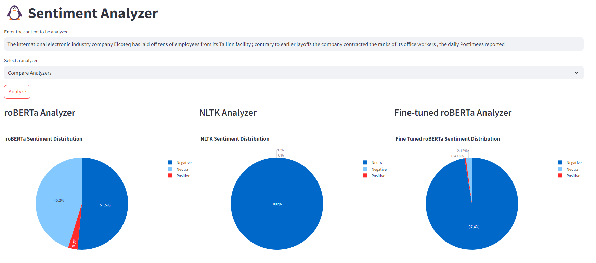

# 🐧 Welcome to Penguin Interprets 
This github repo provides the code to analyze the sentiments as positive, negative and neutral through a pie chart visualization. 

## Installation<a name="installation"></a>

This section describes how to set up and run the Sentiment Analyzer Application, including environment setup and dependency installation.

### Setup

1. **Clone this repository** or download the source code.
   
 ```bash 
 git clone https://github.com/Niticodersh/Sentiment-Analyzer.git
cd Sentiment-Analyzer
``` 
2. **Create a virtual environment** 
- For Unix/Linux/MacOS:
   ```bash
   python3 -m venv analyzer_venv
   source analyzer_venv/bin/activate
   ```
- For Windows:
   ```bash
   python -m venv analyzer_venv
   .\analyzer_venv\Scripts\activate
   ```
3. **Install the requirements from the `requirements.txt` file**

   ```bash
   pip install -r requirements.txt
   ```
4. **Usage**
 To run the streamlit app, use the following command:
 ```bash
 streamlit run app.py
```

## Analyzers

This code provides sentiment analysis using three analyzers.
1. **roBERTa Analyzer**: It uses RoBERTa model (Robustly Optimized BERT Pretraining Approach) by Yinhan Liu, Myle Ott, Naman Goyal, Jingfei Du, Mandar Joshi, Danqi Chen, Omer Levy, Mike Lewis, Luke Zettlemoyer, Veselin Stoyanov. It is based on Google’s BERT model released in 2018.
2. **NLTK Analyzer**: It uses nltk inbuilt library SentimentIntensityAnalyzer.
3. **Fine-tuned roBERTa Analyzer**: The roBERTa is fine-tuned of financial sentiments.

## CLI Based Analyzers
Run the CLI based python files to see the model results. 

For *roBERTa Analyzer* : 
```bash 
python roBERTa_script.py
```

For *NLTK Analyzer* : 
```bash
python nltk_script.py
```

For *Fine-Tuned roBERTa Analyzer (for financial sentiment analysis)* :
```bash
python roBERTa_FineTuned_script.py
```
If you want to know the fine-tuning work flow, look into the ```Sentiment_Analysis in Finance and Stocks.ipynb```

## Streamlit App

We have our app deployed on streamlit to directly use it. 

Go to this streamlit webApp: https://penguin-interprets-sentiment-analyzer-niticodersh.streamlit.app/ 

Note: The fine-tuned model might not be able to get downloaded due to some issue with gdown library and streamlit cloud environment. In case you wish to do normal sentiment analysis, you can directly use the webApp, but if you want to use specially for financial sentiment analysis, it's suggested to run locally by following the commands given under [Installation](#installation).

## Preview of App:

